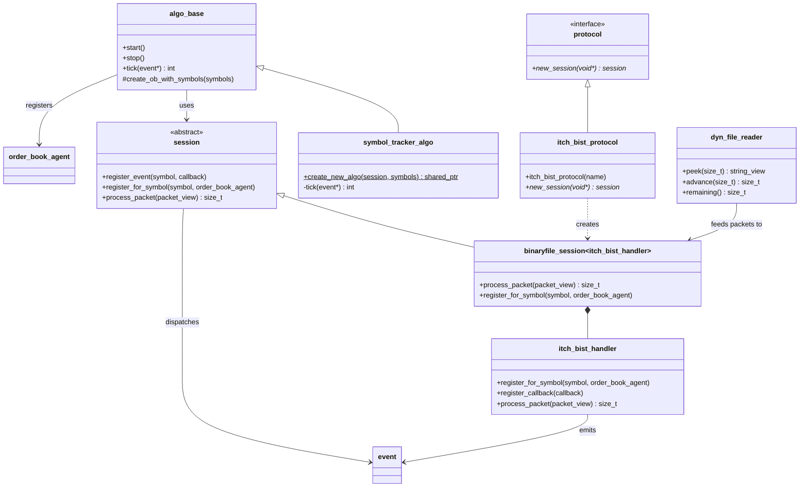

# bist-algo-demo

`bist-algo-demo` replays a BIST ITCH binary file through the Helix feed handler stack and attaches one or more `symbol_tracker_algo` instances to the resulting session. Each algorithm instance reconstructs an order book for its subscribed symbols, listens for order book and trade events, and writes formatted output to a per-symbol result file.

## What the demo does

At runtime, the demo performs these steps:

1. Creates a NASDAQ/BIST binary file protocol with `helix::nasdaq::itch_bist_protocol`.
2. Creates a `helix::session` from that protocol with `protocol.new_session(nullptr)`.
3. Creates `symbol_tracker_algo` instances and binds them to the session.
4. Reads the input binary file packet by packet using `dyn_file_reader`.
5. Passes each packet to `session->process_packet(...)`.
6. Lets the session dispatch events back into the registered algorithms.

The demo currently creates `175` algorithm instances and tracks `178` symbol entries in total. After trimming ITCH symbol padding and removing duplicates, the active demo universe contains `175` unique symbols.

## Build and run

From the repository root:

```bash
cmake -S . -B build
cmake --build build --target bist-algo-demo
./build/bin/bist-algo-demo /absolute/path/to/TR-1.VRD
```

If no input file is passed, the demo falls back to the hardcoded path below:

```text
/Users/okatli/Software/borsa-istanbul-demo-data/TR-1.VRD
```

## Output files

Each `symbol_tracker_algo` instance opens an output file named from its first configured symbol:

```text
/Users/okatli/Software/borsa-istanbul-demo-data/results/result_<symbol>.out
```

That means the first multi-symbol tracker writes to `result_ACSEL.E.out`, even though it also subscribes to `AKBNK.E`, `GARAN.E`, and `HALKB.E`.

## Creating a protocol and session

The demo uses the binary file BIST protocol name `nasdaq-binaryfile-itch-bist`:

```cpp
helix::nasdaq::itch_bist_protocol protocol{"nasdaq-binaryfile-itch-bist"};
std::shared_ptr<helix::session> session(protocol.new_session(nullptr));
```

`itch_bist_protocol::new_session(...)` returns a `binaryfile_session<itch_bist_handler>`, which means the session expects BinaryFILE-framed payloads and delegates message parsing to `itch_bist_handler`.

## Using `symbol_tracker_algo`

The simplest way to attach the algorithm is the same pattern used by the demo:

```cpp
auto algo = helix::symbol_tracker_algo::create_new_algo(
    session,
    {"ASELS.E ", "GARAN.E "}
);
```

How it works internally:

1. `create_new_algo(...)` constructs a `std::shared_ptr<symbol_tracker_algo>`.
2. The constructor creates a formatter/output sink and writes the report header.
3. It converts the symbol list into `(symbol, max_orders)` pairs with a fixed `1000` max-order capacity per symbol.
4. `algo_base::create_ob_with_symbols(...)` creates one `order_book` per symbol.
5. For each symbol, the algorithm registers an `order_book_agent` with the session through `register_for_symbol(...)`.
6. The algorithm also registers an event callback through `session->register_event(...)`.
7. When `session->process_packet(...)` parses a message that affects a subscribed symbol, the callback is dispatched into the algorithm thread pool and `symbol_tracker_algo::tick(...)` processes the event.

## Minimal integration example

```cpp
#include <memory>
#include <vector>

#include "nasdaq/itch_bist_protocol.hh"
#include "symbol_tracker_algo.h"
#include "net.hh"

int main() {
    helix::nasdaq::itch_bist_protocol protocol{"nasdaq-binaryfile-itch-bist"};
    std::shared_ptr<helix::session> session(protocol.new_session(nullptr));

    auto algo = helix::symbol_tracker_algo::create_new_algo(
        session,
        {"ASELS.E ", "THYAO.E "}
    );

    // For every BinaryFILE packet chunk read from disk or another source:
    // session->process_packet(helix::net::packet_view{buffer, length});

    algo.reset();
    session.reset();
}
```

## Mermaid class diagram



## Demo symbols

The list below is normalized from `bist-algo-demo.cpp`, so trailing ITCH padding spaces have been removed. `IDGYO.E` is not included because that line is commented out in the demo.

```text
ACSEL.E, ADEL.E, ADESE.E, AEFES.E, AFYON.E, AGHOL.E, AGYO.E, AKBNK.E,
AKCNS.E, AKENR.E, AKFGY.E, AKGRT.E, AKMGY.E, AKSA.E, AKSEN.E, AKSGY.E,
AKSUE.E, AKYHO.E, ALARK.E, ALBRK.E, ALCAR.E, ALCTL.E, ALGYO.E, ALKA.E,
ALKIM.E, ANELE.E, ANHYT.E, ANSGR.E, ARCLK.E, ARDYZ.E, ARENA.E, ARMDA.E,
ARSAN.E, ASELS.E, ASUZU.E, ATAGY.E, ATEKS.E, AVGYO.E, AVHOL.E, AVISA.E,
AVOD.E, AVTUR.E, AYCES.E, AYEN.E, AYGAZ.E, BAGFS.E, BAKAB.E, BANVT.E,
BAYRK.E, BERA.E, BEYAZ.E, BFREN.E, BIMAS.E, BIZIM.E, BJKAS.E, BLCYT.E,
BNTAS.E, BOSSA.E, BRISA.E, BRKSN.E, BRMEN.E, BRSAN.E, BRYAT.E, BSOKE.E,
BTCIM.E, BUCIM.E, BURCE.E, BURVA.E, CCOLA.E, CELHA.E, CEMAS.E, CEMTS.E,
CEOEM.E, CIMSA.E, CLEBI.E, CMBTN.E, CMENT.E, CRDFA.E, CRFSA.E, CUSAN.E,
DAGHL.E, DAGI.E, DERAS.E, DERIM.E, DESA.E, DESPC.E, DEVA.E, DGATE.E,
DGGYO.E, DGKLB.E, DITAS.E, DMSAS.E, DNISI.E, DOAS.E, DOBUR.E, DOCO.E,
DOGUB.E, DOHOL.E, DOKTA.E, DURDO.E, DYOBY.E, DZGYO.E, ECILC.E, ECZYT.E,
EDIP.E, EGEEN.E, EGGUB.E, EGPRO.E, EGSER.E, EKGYO.E, EMKEL.E, ENJSA.E,
ENKAI.E, ERBOS.E, EREGL.E, ERSU.E, ESCOM.E, ESEN.E, EUHOL.E, FADE.E,
FENER.E, FLAP.E, FMIZP.E, FONET.E, FORMT.E, FROTO.E, GARAN.E, GARFA.E,
GEDIK.E, GEDZA.E, GENTS.E, GEREL.E, GLBMD.E, GLRYH.E, GLYHO.E, GOLTS.E,
GOODY.E, GOZDE.E, GSDDE.E, GSDHO.E, GSRAY.E, GUBRF.E, HALKB.E, HATEK.E,
HDFGS.E, HEKTS.E, HLGYO.E, HUBVC.E, HURGZ.E, ICBCT.E, IDEAS.E, IEYHO.E,
IHEVA.E, IHGZT.E, IHLAS.E, IHLGM.E, IHYAY.E, INDES.E, INFO.E, INTEM.E,
INVEO.E, IPEKE.E, ISATR.E, ISBTR.E, ISCTR.E, ISDMR.E, ISFIN.E, ISGSY.E,
ISGYO.E, ISMEN.E, ITTFH.E, IZFAS.E, IZMDC.E, IZTAR.E, JANTS.E
```
